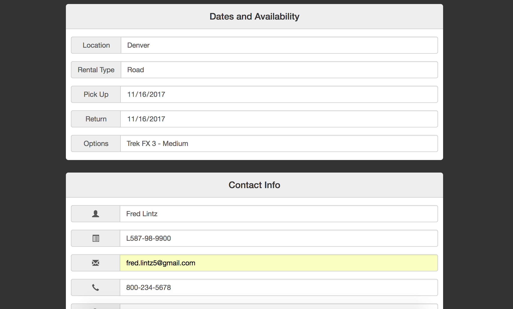

 # Bicycle Rental Web App
> My focus with this site is to make an application for businesses to manage their rental fleets.

>Initially I will set it up for internal employee use, checking availability, storing customer data, customer waivers, and recieving payments. 

>Down the line, Id like it to have the ability to embed into a retailer's website, allowing for customer interaction, and rental reservations.

>Also, I'd like to provide the retailer with a dashboard to manage their fleet, rates, see trends and export customer data.

<!-- ## Usage example

A few motivating and useful examples of how your product can be used. Spice this up with code blocks and potentially more screenshots.

_For more examples and usage, please refer to the [Wiki][wiki]._ -->

## Authors

- Fred Lintz - (https://github.com/fredlintz5)

## Contributing

1. Fork it (<https://github.com/fredlintz5/SnapBiz/fork>)
2. Create your feature branch (`git checkout -b feature/fooBar`)
3. Commit your changes (`git commit -am 'Add some fooBar'`)
4. Push to the branch (`git push origin feature/fooBar`)
5. Create a new Pull Request

